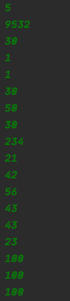
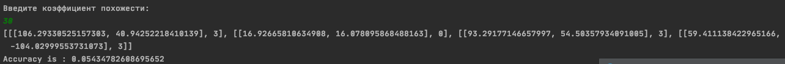
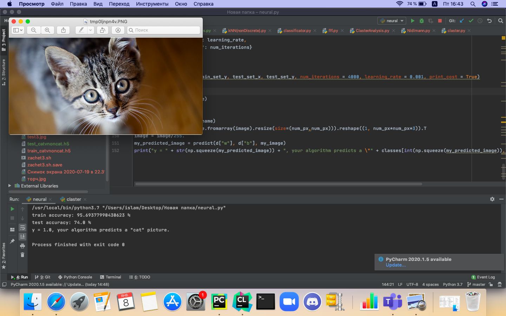

# MachineLearning
-------
# Индивидуальные задачи
 # 1)Метрики. Алгоритм Нидлмана-Вунша.
    
    Есть две последовательности, надо провести выравнивание. Для этого динамикой заполняется таблица n x m, где n,m - длины последовательностей. 
    Таблица заполняется таким образом что на каждой итерации выбирается минимум из предложенных действий(удаление, вставка, замена).
    В ячейке (n+1)(m+1) хранится ответ - Расстояние Левенштейна. Для поиска действий для выравнивания я прошелся обратно запоминая какие действия выбирал во время минимизирования
     
    Для последовательностей длиной >10^4 я получал ответ в течении 20-22 минут(скрин не сохранил), что очень долго.Для 10^5 я так и не дождался результата. Скорее всего не стоило запоминать всю таблицу
    размером 10^5 на 10^5, это слишком много, но тогда я не смогу определить какие действия для выравнивания совершал.
    Вот как выглядит вывод для произвольных последовательностей(V - вставка, Z - замена, U - удаление)
  
    
    не понимаю как ускорить работу алгоритма
    Весь код: https://github.com/enoki1/MachineLearning/blob/main/Nidlmann.py
    
 # 2)Классификация в непрерывном пространстве.Школы и жители
  1) Есть сетка(город(квадратный)) внутри сетки выбираются точки(люди) в узлах школы, человек может ходить лишь только по улицам, найти школу к которой человек относится
 заданы прямые k1 и k2 штук(заданы коодринаты школ) далее набор координат жителей. найти ближайшую школу для человека(ходим только по сетке, когда мы в одной клетке то можем шагнуть перпендикулярно)

  # Начальные условия:
   1) Город квадратный
   2) Сетка равномерная
   
 # Описание метода
   
  Научиться быстро решать эту задачу у меня не получилось, в конечном итоге все свелось к нехитрому перебору и геометрии на плоскости. Пытался реализовать алгоритм Форчуна, но сделать это без каких-либо доп.библиотек не получилось
  Весь код: https://github.com/enoki1/MachineLearning/blob/main/Schools.py
  
#  3)Кластеризация на плоскости.
    Нужно было сгенерировать некоторые точки на плоскости и попробовать их разделить на кластеры.
    Код : https://github.com/enoki1/MachineLearning/blob/main/claster.py
   # Генерация 
        Программа на вход принимает число окружностей  и число точек внутри каждой окружности. Далее я ввожу центры окружностей и их радиусы. Внутри каждой окружности я случайным образом генерирую точки. Это было сделано для облегчения проверки ответа.
   # Алгоритм
       Для приблизительного анализа числа кластеров использовался метод иерархической кластеризации, благодаря которому я находил примерное число кластеров и изначальные положения центроидов.
       Далее я реализовал алгоритм K-MEANS, с помощью которого провел кластеризацию
  # Тесты
  
    
      Здесь будет 5 окружностей, всего около 10000 точек, коэффициент "похожести" равен 30. Этот коэффициент позволяет определяет какие элементы мы считаем близкими, а какие нет. Далее идут координаты окружностей и их радиусы. К Слову, такая скорость выполнения меня устраивает.
      Вывод в этом случае:
  
  
  Второй тест(более очевидный для проверки)
  
  
  
  Вывод :
  
    Легко проверить что кластеризация выполнилось верно, точки внутри окружностей с центром в (1,1) и (10,10) соединились. Всего кластеров 4
# 4) Регрессия (-----)

# Командные задачи
 # 1) Классификация в дискретном пространстве
     Есть такая компьютерная игра PUBG, наткнулся на датасет по результатам матчей в этой игре. Попытался классифицировать объекты исходя из данных в этой базе.
   # Описание
      Данный датафрейм состоит из различных убийств игроков,
      а именно: есть столбы(Оружие из которого убит игрок, никнейм убийцы, координаты убийцы, координаты игрока, и еще много всего)
      Я посчитал для каждого события дистанцию из которого было сделано убийство
      и попробовал классифицировать каждое событие исходя из дистанции убийства. 
      
      Классифицировал по типу оружия, из которого могло быть сделано убийство.
      Например, если убийство сделано со 150м, то наверняка убийца стрелял из снайп. винтовки.
      Всего классов 8: Холодное оружие, пистолет, дробовик, штурм винтовка, снайп.винтовка(балтовка),
      марксманская винтовка, граната, пистолет-пулемет.
      Весь код: https://github.com/enoki1/MachineLearning/blob/main/classificator.py
      Кусок датафрейма:
      
   
   # Условия эксперимента
     С начала я удалил все строки из датафрейма, в которых остутствовали какие-то показатели.
     Далее при анализе датафрейма я столкнулся с необычными случаями. Например, один игрок убил другого с расстояния более 7ми километров, и сделал он это из дробовика, что невозможно, даже для снайп. винтовки.
     Пришлось исключать такие феноменальные истории. 
     Далее я исключил все смерти вызванные игровыми условиями(смерть от зоны, смерть под водой, падение с высоты и прочее)
  # Проведение эксперимента
     Я скачал два датафрейма, один для теста, другой для тренировки.
     Среди всего датафрейма я посчитал среднюю дистанцию убийства для каждого типа оружия, получил такие показатели
     
      
     Классифицировать я буду просто, к какому из средних значений значение конкретного убийства ближе, из того типа оружия и стреляли
  # Результаты
  
  
  
  Результат более чем очевиден, с таким подходом к классификации вряд ли добиться высокой точности. Проблема в том, что во время игры возникают разные боевые ситуации, например "клоузфайтинг".
  При штурме дома разные игроки используют разные оружия и поэтому нельзя точно сказать, c какого оружия сделано убийство. 
  Особенно большой разброс заметен у штурмовых винтовок
 # 2) Классификация точек на плоскости
   # Описание
     Сгенерировать точки на плоскости и попробовать их классифицировать методом kNN.
     Весь код: https://github.com/enoki1/MachineLearning/blob/main/kNN(nonDiscrete).py
  # Условия эксперимента
     Я в ограниченной области генерирую окружности и их радиусы, внутри них генерируются точки. Количество классов во всех экспериментах -- 4.
  # Проведение эксперимента 
   Из общего числа точек, я генерирую две выборки(тестовую и тренировочную), далее реализую kNN. В данной задаче я воспользовался доп.библиотеками python
   
  # Результаты

  В целом, результаты довольно-таки точные, бывают случаи когда все классы налегают друг на друга, в таких случаях точность очевидно падает
  
 # 3) Анализ кластеризации
    Попытаться провести анализ кластеризации на какой-то выборке.
    Весь код: https://github.com/enoki1/MachineLearning/blob/main/ClasterAnalysis.py
  # Описание
    В одной из прошлых задач я реализовал алгоритм кластеризации, но выборка была довольно-таки удобной для работы. В этот раз я попытался сделать так, чтобы 
    кластеризация была сложной
  # Условия
    Я буду генерировать несколько окружностей с одним центром и разными радиусами, каждый раз я буду брать только те точки, которые лежат в окружности, но не лежат в прошлой окружности(чтобы получались концентрические кластеры). Изначально мне известен класс кажого элемента, затем я просто сверяю свои данные,
    c данными алгоритма
    Это выглядит вот так:
    
 
 # Результаты
  результаты для данных из скриншота выше
  
  еще результаты
  
  
  Как и ожидалось, точно низкая и почти все определяется неправильно, но в таком случае можно повысить шансы на 
  
  А вот неожиданный результат:
  
  
  
  Я сделал коэффициент похожести равным 1000, то есть по сути каждый элемент похож на любой. В таком случае точность достигает почти 0.5,
  не могу особо объяснить это явление.
  
  # 4) Регрессия(-----)
  
  # Нейронная сеть
    Написать нейронную сеть анализирующая фотографии, с бинарным выбором.
    весь код: https://github.com/enoki1/MachineLearning/blob/main/neural.py
   # Описание
     Нейросеть должна определять кот или не кот на изображении.
   # Реализация 
     Для реализации я прошел часть курса Deep Learning от Andrew Ng на курсере. Не сказал бы что я до конца понимаю работу нейросетей=)
     В чем суть, на вход поступает изображение(размером mxn) изображение выглядит как трехмерная таблица с числами, это  таблицы цветов пикселей R,G,B.
     Для начала каждую фотографию с помощью векторизации записывают в виде столбика. Затем из таких столбиков составляют матрицу изображений.
     Основной идеей выступает градиентный спуск, в котором входные переменные как-то изменяются, изменяются столько раз сколько я скажу и с определенным 
     коэффициентом.
     В алгоритме используется сигмоидная функция вида 1/(1 + e^x)), как я понял, она нужна лишь для вероятностной оценки предсказания алгоритма.
     Функция весьма удобная для тервера.
   # Результаты
   В целом нейросеть работает нормально, иногда ошибается, но зачастую говорит правильно
   
   
   
     
    
    
